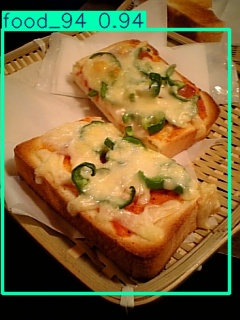
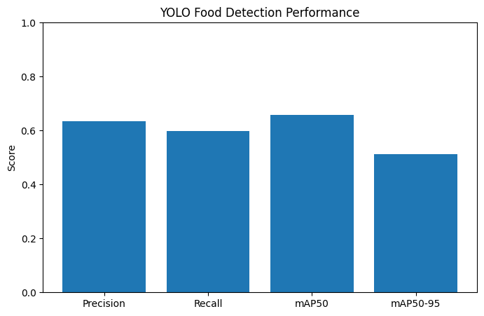
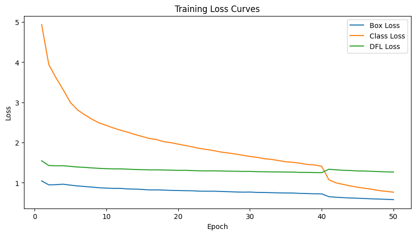
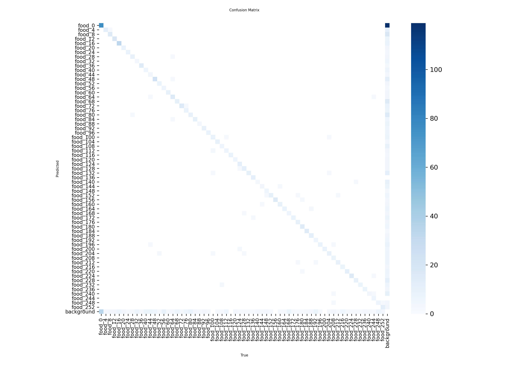

# KidsNutriBite YOLOv8n Object Detection

This repository contains the YOLOv8 Nano object detection model notebook utilized in the KidsNutriBite project.

## Project Overview
KidsNutriBite is designed to assist in nutritional tracking and children food analysis. This notebook implements object detection utilizing Ultralytics YOLOv8.

## Contents
- yolo8n.ipynb: Training and inference code for food item classification and detection.

## Training Metrics & Evaluation Graphs
Here are the metrics and graphs extracted directly from the training notebook runs:

### Metric Chart 1

### Metric Chart 2

### Training Results

### Confusion Matrix

